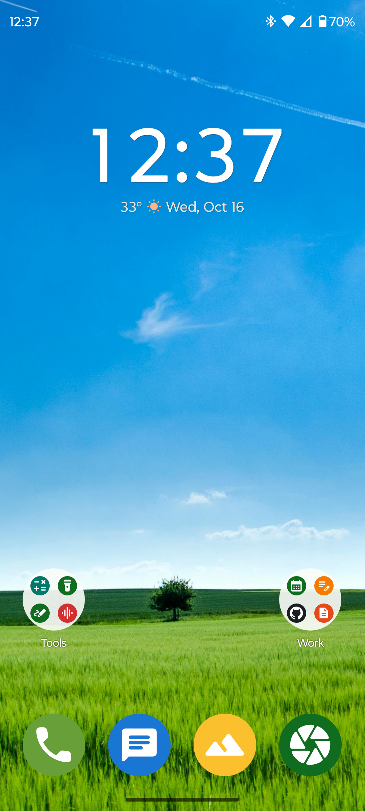
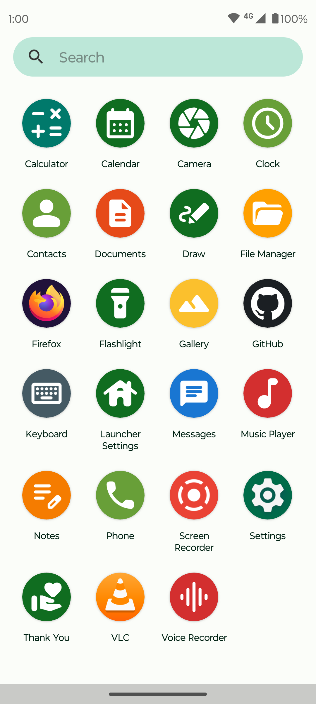
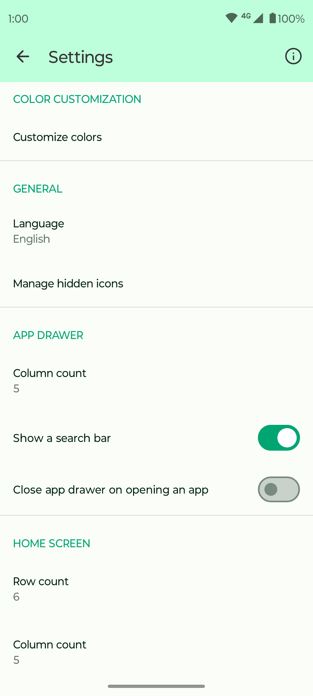

# Fossify Launcher

  

Fossify Launcher is your gateway to a fast, personalized, and privacy-first home screen experience.
No ads, no bloat – just a smooth, efficient launcher designed to fit your unique style and
preferences.

**🚀 LIGHTNING-FAST NAVIGATION:**  
Navigate your device with speed and precision. Fossify Launcher is optimized to be responsive and
fluid, giving you instant access to your favorite apps without lag.

**🎨 FULL CUSTOMIZATION:**  
Tailor your home screen with dynamic themes, custom colors, and layouts. Personalize your launcher
to match your style with easy-to-use tools that let you create a truly unique setup.

**🖼️ COMPLETE WIDGET SUPPORT:**  
Integrate fully resizable widgets with ease. Whether you need clocks, calendars, or other handy
tools, Fossify Launcher ensures they blend seamlessly into your home screen design.

**📱 NO UNWANTED CLUTTER:**  
Effortlessly manage your apps by hiding or uninstalling them in just a few taps, keeping your home
screen organized and clutter-free.

**🔒 PRIVACY AND SECURITY:**  
Your privacy is at the heart of Fossify Launcher. With no internet access and no intrusive
permissions, your data stays with you. No tracking, no ads – just a launcher built to respect your
privacy.

**🌐 OPEN-SOURCE ASSURANCE:**  
Fossify Launcher is built on an open-source foundation, allowing you to review our code on GitHub,
fostering trust and a community committed to privacy.

Find your balance of speed, customization, and privacy with Fossify Launcher.

➡️ Explore more Fossify apps: https://www.fossify.org 
➡️ Open-Source Code: https://www.github.com/FossifyOrg 
➡️ Join the community on Reddit: https://www.reddit.com/r/Fossify 
➡️ Connect on Telegram: https://t.me/Fossify

